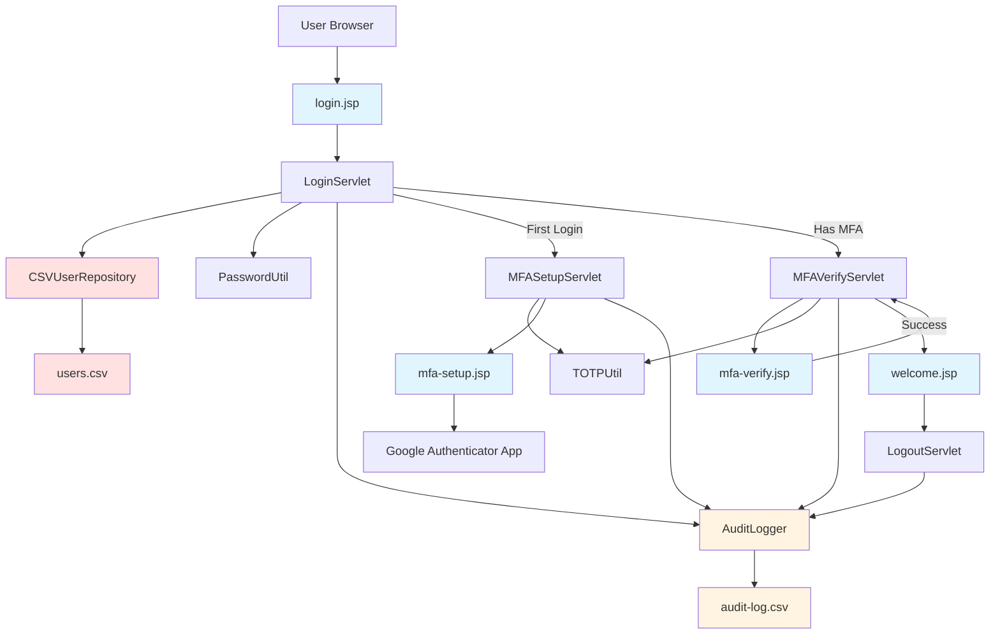

# MFA POC Architecture Plan

## Project Overview
A J2EE web application demonstrating Multi-Factor Authentication (MFA) using Google Authenticator with TOTP (Time-based One-Time Password). The application simulates LDAP authentication using a CSV file and implements industry-standard security practices.

## Technology Stack

### Backend
- **Java**: 11
- **Build Tool**: Maven 3.8+
- **Web Container**: Apache Tomcat (via Maven plugin)
- **Servlet API**: 4.0+
- **JSP**: 2.3+

### Security & Authentication
- **Password Hashing**: BCrypt
- **MFA/TOTP**: java-otp library
- **Session Management**: HttpSession with security constraints

### Testing
- **Unit Testing**: JUnit 5
- **Integration Testing**: Playwright for Java
- **Test Reporting**: Maven Surefire/Failsafe plugins

### Data Storage
- **User Repository**: CSV file (simulating LDAP)
- **MFA Secrets**: Stored in CSV after first login

## System Architecture



## Component Design

### 1. Data Layer

#### User Model
```java
class User {
    - username: String
    - password: String (BCrypt hashed)
    - fullName: String
    - email: String
    - status: String (ACTIVE/DISABLED)
    - role: String
    - mfaSecret: String (nullable)
}
```

#### AuditLog Model
```java
class AuditLog {
    - timestamp: LocalDateTime
    - username: String
    - action: String (LOGIN_ATTEMPT, LOGIN_SUCCESS, LOGIN_FAILED, MFA_SETUP, MFA_VERIFY_SUCCESS, MFA_VERIFY_FAILED, LOGOUT)
    - status: String (SUCCESS/FAILED)
    - ipAddress: String
    - details: String (additional context)
}
```

#### CSVUserRepository
- Reads/writes user data from CSV
- Thread-safe operations
- Manages MFA secret persistence
- Validates user credentials

#### AuditLogger
- Writes audit entries to CSV file
- Thread-safe append operations
- Captures all MFA-related activities
- Includes timestamp, user, action, status, IP, and details
- Supports audit trail analysis

### 2. Security Layer

#### PasswordUtil
- BCrypt hashing (strength: 12)
- Password validation
- Secure password generation for testing

#### TOTPUtil
- Generate TOTP secrets
- Create QR code URLs for Google Authenticator
- Validate TOTP codes (6-digit)
- Time window: 30 seconds

### 3. Web Layer

#### Servlets

**LoginServlet** (`/login`)
- Validates username/password
- Checks user status (active/disabled)
- Routes to MFA setup or verification
- Session management
- Logs all login attempts (success/failure)

**MFASetupServlet** (`/mfa-setup`)
- Generates TOTP secret
- Creates QR code URL
- Stores secret in CSV
- Displays setup instructions
- Logs MFA setup activity

**MFAVerifyServlet** (`/mfa-verify`)
- Validates TOTP code
- Grants access on success
- Handles failed attempts
- Session security
- Logs MFA verification (success/failure)

**LogoutServlet** (`/logout`)
- Invalidates session
- Redirects to login
- Logs logout event

#### JSP Pages

**login.jsp**
- Professional UI with Prolifics logo
- Username/password form
- Error message display
- Responsive design

**mfa-setup.jsp**
- QR code display
- Setup instructions
- Manual entry option
- Continue button

**mfa-verify.jsp**
- TOTP code input (6 digits)
- User-friendly interface
- Error handling
- Resend option

**welcome.jsp**
- Personalized greeting
- User information display
- Navigation options
- Logout button

### 4. Security Features

#### Implemented Security Measures
1. **Password Security**
   - BCrypt hashing with salt
   - Minimum 8 characters
   - Complexity requirements
   - No plaintext storage

2. **Session Security**
   - Secure session cookies
   - Session timeout (30 minutes)
   - Session invalidation on logout
   - CSRF protection considerations

3. **MFA Security**
   - TOTP standard (RFC 6238)
   - 30-second time window
   - Secret key encryption
   - QR code security

4. **Input Validation**
   - SQL injection prevention (N/A for CSV)
   - XSS prevention in JSP
   - Parameter validation
   - Error message sanitization

5. **Access Control**
   - Authentication required for protected pages
   - Session-based authorization
   - Disabled user blocking
   - Role-based access (future enhancement)

## Test Users

### User Scenarios
1. **Active User - First Login**: john.smith / SecurePass123!
2. **Active User - Existing MFA**: jane.doe / Welcome2024!
3. **Active User - Admin Role**: admin.user / Admin@2024
4. **Disabled User**: disabled.user / Disabled123!
5. **Active User - Standard**: bob.wilson / BobSecure99!

## Testing Strategy

### Unit Tests (JUnit 5)
- PasswordUtil: hashing, validation
- TOTPUtil: secret generation, code validation
- CSVUserRepository: CRUD operations
- User model: validation logic

### Integration Tests (Playwright)
- Complete login flow
- MFA setup process
- MFA verification
- Disabled user handling
- Session management
- Logout functionality

### Test Scenarios
1. Valid login with first-time MFA setup
2. Valid login with existing MFA
3. Invalid password attempt
4. Invalid TOTP code
5. Disabled user login attempt
6. Session timeout handling
7. Concurrent user sessions
8. QR code generation
9. Manual secret entry
10. Logout and re-login

## Deployment

### Build Process
```bash
mvn clean package
mvn tomcat7:run
```

### Access URLs
- Application: http://localhost:8080/mfa-poc
- Login: http://localhost:8080/mfa-poc/login
- Welcome: http://localhost:8080/mfa-poc/welcome

### Configuration
- Port: 8080 (configurable in pom.xml)
- Context Path: /mfa-poc
- Session Timeout: 30 minutes

## Documentation Deliverables

### SDLC Documentation
1. **Architecture Document** (this file)
2. **Design Document**: Detailed component specifications
3. **Deployment Guide**: Step-by-step deployment instructions
4. **Security Documentation**: Security measures and compliance

### Technical Documentation
1. **API Documentation**: Servlet endpoints and parameters
2. **Code Documentation**: JavaDoc for all classes
3. **Database Schema**: CSV file structure and fields

### User Documentation
1. **User Guide**: End-user instructions with screenshots
2. **Admin Guide**: User management and troubleshooting
3. **Setup Guide**: Google Authenticator configuration

### Test Documentation
1. **Test Plan**: Comprehensive test scenarios
2. **Test Scripts**: Automated test code
3. **Test Report**: Execution results and coverage
4. **Bug Report**: Issues found and resolutions

## Project Structure

```
mfa-poc/
├── src/
│   ├── main/
│   │   ├── java/
│   │   │   └── com/
│   │   │       └── prolifics/
│   │   │           └── mfa/
│   │   │               ├── model/
│   │   │               │   └── User.java
│   │   │               ├── repository/
│   │   │               │   └── CSVUserRepository.java
│   │   │               ├── util/
│   │   │               │   ├── PasswordUtil.java
│   │   │               │   └── TOTPUtil.java
│   │   │               └── servlet/
│   │   │                   ├── LoginServlet.java
│   │   │                   ├── MFASetupServlet.java
│   │   │                   ├── MFAVerifyServlet.java
│   │   │                   └── LogoutServlet.java
│   │   ├── webapp/
│   │   │   ├── WEB-INF/
│   │   │   │   └── web.xml
│   │   │   ├── css/
│   │   │   │   └── style.css
│   │   │   ├── images/
│   │   │   │   └── prolifics-logo.png
│   │   │   ├── login.jsp
│   │   │   ├── mfa-setup.jsp
│   │   │   ├── mfa-verify.jsp
│   │   │   └── welcome.jsp
│   │   └── resources/
│   │       └── users.csv
│   └── test/
│       └── java/
│           └── com/
│               └── prolifics/
│                   └── mfa/
│                       ├── util/
│                       │   ├── PasswordUtilTest.java
│                       │   └── TOTPUtilTest.java
│                       ├── repository/
│                       │   └── CSVUserRepositoryTest.java
│                       └── integration/
│                           └── MFAFlowTest.java
├── docs/
│   ├── TEST_PLAN.md
│   ├── USER_GUIDE.md
│   ├── SECURITY.md
│   └── API_DOCUMENTATION.md
├── pom.xml
└── README.md
```

## Success Criteria

### Functional Requirements
- ✓ User authentication with CSV-based user store
- ✓ MFA setup on first login
- ✓ TOTP validation with Google Authenticator
- ✓ Professional UI with Prolifics branding
- ✓ Session management and logout
- ✓ Disabled user handling

### Non-Functional Requirements
- ✓ Security best practices implemented
- ✓ Comprehensive test coverage (>80%)
- ✓ Complete SDLC documentation
- ✓ Automated test execution
- ✓ Production-like appearance
- ✓ Easy deployment and setup

### Quality Gates
1. All unit tests pass
2. All integration tests pass
3. No critical security vulnerabilities
4. Code documentation complete
5. User documentation complete
6. Test report generated
7. All bugs fixed and verified

## Timeline Estimate

1. **Project Setup & Configuration**: 1 hour
2. **Core Implementation**: 3-4 hours
3. **UI Development**: 2-3 hours
4. **Testing Implementation**: 2-3 hours
5. **Test Execution & Bug Fixes**: 1-2 hours
6. **Documentation**: 2-3 hours

**Total Estimated Time**: 11-16 hours

## Next Steps

Once this plan is approved, the implementation will proceed in the following order:
1. Project structure and Maven configuration
2. Core security utilities and models
3. Servlet implementation
4. JSP and UI development
5. Test implementation
6. Test execution and bug fixes
7. Documentation generation

---

**Note**: This is a POC (Proof of Concept) implementation. For production use, additional considerations would include:
- Database integration instead of CSV
- HTTPS/SSL configuration
- Rate limiting and brute force protection
- Audit logging
- Backup and recovery procedures
- Load balancing and scalability
- Compliance certifications (SOC2, ISO 27001, etc.)