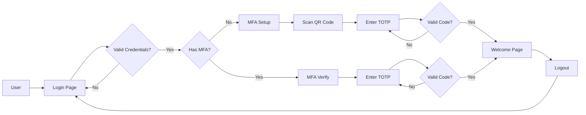

# MFA POC Project Summary

## 🎯 Project Goal
Build a production-ready J2EE web application demonstrating Multi-Factor Authentication (MFA) using Google Authenticator with TOTP, simulating LDAP authentication via CSV file storage.

## 📋 Key Requirements

### Functional Requirements
✅ **Authentication System**
- Username/password login with CSV-based user store
- BCrypt password hashing (minimum 8 characters, complexity rules)
- Account status validation (active/disabled)

✅ **MFA Implementation**
- Google Authenticator integration (TOTP)
- QR code generation for easy setup
- First-time MFA setup flow
- TOTP code verification (6-digit, 30-second window)

✅ **Audit Logging**
- Comprehensive logging of all MFA-related activities
- Separate CSV file for audit trail
- Logs login attempts, MFA setup, verification, and logout
- Includes timestamp, username, action, status, IP address, and details
- Thread-safe operations for concurrent access

✅ **User Interface**
- Professional login page with Prolifics logo
- Modern, production-like design
- Responsive and user-friendly
- Pleasant welcome page after authentication

✅ **Test Users**
- 5 users with different scenarios
- Valid names and secure passwords
- Include disabled user for testing

### Technical Requirements
✅ **Technology Stack**
- Java 11
- Maven 3.8+
- JSP and Servlets
- Maven Tomcat plugin for testing
- java-otp library for TOTP
- BCrypt for password hashing

✅ **Testing**
- JUnit 5 for unit tests
- Playwright for integration tests
- Automated test execution
- Complete test report generation
- Bug fixing and re-testing

✅ **Documentation**
- Complete SDLC documentation
- Test plan with detailed scripts
- User guides
- Security documentation
- API documentation

## 👥 Test Users

| Username | Password | Status | Role | Scenario |
|----------|----------|--------|------|----------|
| john.smith | SecurePass123! | ACTIVE | USER | First-time login, MFA setup |
| jane.doe | Welcome2024! | ACTIVE | USER | Existing MFA configured |
| admin.user | Admin@2024 | ACTIVE | ADMIN | Admin with MFA |
| disabled.user | Disabled123! | DISABLED | USER | Account disabled |
| bob.wilson | BobSecure99! | ACTIVE | USER | Standard user testing |

## 🏗️ Architecture Overview



## 📦 Project Structure

```
mfa-poc/
├── src/
│   ├── main/
│   │   ├── java/com/prolifics/mfa/
│   │   │   ├── model/User.java
│   │   │   ├── repository/CSVUserRepository.java
│   │   │   ├── util/PasswordUtil.java
│   │   │   ├── util/TOTPUtil.java
│   │   │   └── servlet/
│   │   │       ├── LoginServlet.java
│   │   │       ├── MFASetupServlet.java
│   │   │       ├── MFAVerifyServlet.java
│   │   │       └── LogoutServlet.java
│   │   ├── webapp/
│   │   │   ├── WEB-INF/web.xml
│   │   │   ├── css/style.css
│   │   │   ├── images/prolifics-logo.png
│   │   │   ├── login.jsp
│   │   │   ├── mfa-setup.jsp
│   │   │   ├── mfa-verify.jsp
│   │   │   └── welcome.jsp
│   │   └── resources/users.csv
│   └── test/java/com/prolifics/mfa/
│       ├── util/PasswordUtilTest.java
│       ├── util/TOTPUtilTest.java
│       ├── repository/CSVUserRepositoryTest.java
│       └── integration/MFAFlowTest.java
├── docs/
│   ├── TEST_PLAN.md
│   ├── USER_GUIDE.md
│   ├── SECURITY.md
│   ├── API_DOCUMENTATION.md
│   ├── DESIGN.md
│   ├── DEPLOYMENT.md
│   └── ADMIN_GUIDE.md
├── ARCHITECTURE.md
├── IMPLEMENTATION_PLAN.md
├── pom.xml
└── README.md
```

## 🔒 Security Features

### Password Security
- ✅ BCrypt hashing with salt (strength: 12)
- ✅ Minimum 8 characters
- ✅ Complexity requirements (uppercase, lowercase, digit, special char)
- ✅ No plaintext storage

### MFA Security
- ✅ TOTP standard (RFC 6238)
- ✅ 30-second time window
- ✅ Secure secret generation
- ✅ QR code for easy setup

### Session Security
- ✅ Secure session cookies
- ✅ 30-minute timeout
- ✅ Session invalidation on logout
- ✅ Authentication required for protected pages

### Input Validation
- ✅ XSS prevention in JSP
- ✅ Parameter validation
- ✅ Error message sanitization
- ✅ Account status checking

## 🧪 Testing Strategy

### Unit Tests (JUnit 5)
- PasswordUtil: hashing, validation, policy
- TOTPUtil: secret generation, code validation
- CSVUserRepository: CRUD operations
- AuditLogger: log writing, thread safety
- Coverage target: >80%

### Integration Tests (Playwright)
- Complete login flow
- MFA setup process
- MFA verification
- Disabled user handling
- Session management
- Logout functionality

### Test Scenarios
1. ✅ Valid login with first-time MFA setup
2. ✅ Valid login with existing MFA
3. ✅ Invalid password attempt
4. ✅ Invalid TOTP code
5. ✅ Disabled user login attempt
6. ✅ Session timeout handling
7. ✅ Concurrent user sessions
8. ✅ QR code generation
9. ✅ Manual secret entry
10. ✅ Logout and re-login
11. ✅ Audit log entries verification

## 📚 Documentation Deliverables

### SDLC Documentation
- ✅ Architecture Document
- ✅ Design Document
- ✅ Deployment Guide
- ✅ Security Documentation

### Technical Documentation
- ✅ API Documentation
- ✅ JavaDoc for all classes
- ✅ CSV Schema Documentation

### User Documentation
- ✅ User Guide with screenshots
- ✅ Admin Guide
- ✅ Setup Guide for Google Authenticator

### Test Documentation
- ✅ Test Plan with detailed scenarios
- ✅ Test Scripts (automated)
- ✅ Test Report with execution results
- ✅ Bug Report with resolutions
- ✅ Audit Log Analysis Report

## 📅 Implementation Timeline

### Phase 1: Foundation (4-5 hours)
- Project structure and Maven setup
- User model and CSV repository
- Security utilities (Password, TOTP)

### Phase 2: Web Layer (4-5 hours)
- Servlet implementation
- JSP pages with professional UI
- CSS styling
- Configuration

### Phase 3: Testing (4-5 hours)
- Unit tests
- Integration tests
- Test execution
- Bug fixes and re-testing

### Phase 4: Documentation (3-4 hours)
- SDLC documents
- Technical documentation
- User guides
- Final review

**Total Estimated Time: 15-19 hours**

## ✅ Success Criteria

### Functional
- ✅ All 5 test users work correctly
- ✅ Login authentication functional
- ✅ MFA setup works seamlessly
- ✅ TOTP validation accurate
- ✅ Session management secure
- ✅ UI professional and responsive
- ✅ Audit logging comprehensive

### Technical
- ✅ All tests pass (100%)
- ✅ Code coverage >80%
- ✅ No critical bugs
- ✅ Build successful
- ✅ Application runs on Tomcat

### Documentation
- ✅ All documents complete
- ✅ Screenshots included
- ✅ Clear instructions
- ✅ Professional formatting

## 🚀 Quick Start (After Implementation)

```bash
# Clone the repository
cd mfa-poc

# Build the project
mvn clean package

# Run tests
mvn test

# Start Tomcat server
mvn tomcat7:run

# Access application
http://localhost:8080/mfa-poc
```

## 📱 Google Authenticator Setup

1. Download Google Authenticator app
2. Login with username/password
3. Scan QR code displayed
4. Enter 6-digit code
5. Access granted!

## 🔧 Maven Commands

```bash
# Clean and build
mvn clean package

# Run unit tests
mvn test

# Run integration tests
mvn verify

# Generate test reports
mvn site

# Start Tomcat
mvn tomcat7:run

# Stop Tomcat
Ctrl+C
```

## 📊 Test Coverage Goals

| Component | Target | Status |
|-----------|--------|--------|
| Model | >90% | Pending |
| Repository | >85% | Pending |
| Utilities | >90% | Pending |
| Servlets | >80% | Pending |
| Integration | 100% | Pending |
| **Overall** | **>80%** | **Pending** |

## 🎨 UI Features

### Login Page
- Prolifics logo (top-left, 40px margin)
- Modern gradient background
- Centered login card with shadow
- Professional form styling
- Error message display

### MFA Setup Page
- Large QR code display
- Step-by-step instructions
- Manual secret entry option
- Download links for Google Authenticator
- Verification input

### MFA Verify Page
- User greeting
- 6-digit code input
- Clear instructions
- Error handling
- Help text

### Welcome Page
- Personalized greeting
- User information card
- Dashboard layout
- Navigation menu
- Logout button

## 🔐 Password Policy

All test user passwords follow these rules:
- ✅ Minimum 8 characters
- ✅ At least 1 uppercase letter
- ✅ At least 1 lowercase letter
- ✅ At least 1 digit
- ✅ At least 1 special character
- ✅ BCrypt hashed in storage

## 📈 Project Metrics

| Metric | Target | Description |
|--------|--------|-------------|
| Code Coverage | >80% | Unit + Integration tests |
| Build Time | <2 min | Maven clean package |
| Response Time | <1 sec | Page load time |
| Test Pass Rate | 100% | All tests must pass |
| Documentation | 100% | All docs complete |

## 🎯 Next Steps

1. **Review this plan** - Ensure all requirements are covered
2. **Approve to proceed** - Give green light for implementation
3. **Switch to Code mode** - Begin development
4. **Follow phases** - Implement step-by-step
5. **Test continuously** - Run tests after each phase
6. **Document as you go** - Keep docs updated
7. **Deliver POC** - Complete, tested, documented

---

## 📝 Notes

- This is a POC (Proof of Concept) for demonstration purposes
- CSV file simulates LDAP for simplicity
- Production deployment would require:
  - Real LDAP/AD integration
  - Database instead of CSV
  - HTTPS/SSL configuration
  - Rate limiting
  - Audit logging
  - Backup procedures

---

**Ready to start implementation? Please review and approve this plan!**